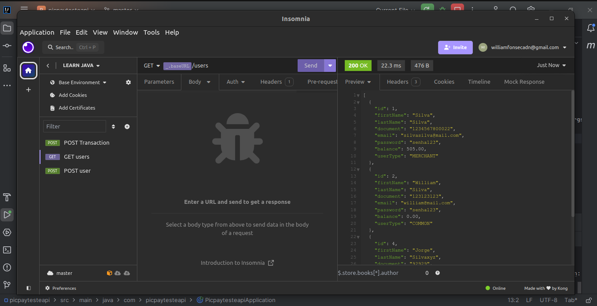

<h1 align="center">Java Backend Spring (Desafio PicPay)</h1>

<p align="center">
  

  

  
  
  <a href="https://github.com/williamjayjay/Github-Blog/commits/master">
    
  </a>
    
   <a href="https://github.com/williamjayjay/java-backend-spring-picpay/stargazers">
    
  </a>
</p>

<p align="center"><p align="center">
Nesse projeto é possível depositar e realizar transferências de dinheiro entre usuários. Temos 2 tipos de usuários, os comuns e lojistas, ambos têm carteira com dinheiro e realizam transferências entre eles.</p>

<p align="center">

</p>

## VideoCase


## Backend Java:

**API:** Desenvolvi esse projeto para reforçar meu conhecimento com Java e Spring.
O Spring Web foi uma das depêndencias que escolhi para desenvolver essa API Restful.
O Spring Data JPA foi escolhido para termos a persistência dos nosso dados.
Ja o Lombok foi escolhido para gerar os getters,setters,constructors de forma mais simples .
O Spring Boot DevTools para ajudar no desenvolvimento.
Ja o H2 Database por mais que seja um banco de dados em memória, ele nos auxilia pela agilidade do desenvolvimento e no foco concentrado na regra de negócio da aplicação. 

## 🚀 Tecnologias

Principais tecnologias que utilizei para desenvolver esta aplicação

- [Maven]
- [Spring Web](https://start.spring.io/)
- [Spring Data JPA](https://start.spring.io/)
- [Lombok](https://start.spring.io/)
- [Spring Boot DevTools](https://start.spring.io/)
- [H2 Database](https://start.spring.io/)


## Guia de inicialização

Para instalar e configurar uma cópia local, siga estas etapas simples:

### Prerequisitos

Para garantir o funcionamento adequado da nossa aplicação, verifique abaixo:

1. **Clone o repositório**:
  ```sh
  git clone https://github.com/williamjayjay/java-backend-spring-picpay
  ```

2. **Instale os módulos com o maven:**

3. **A API estará acessível em:**
  ```sh
  http://localhost:8080
  ```

## Roadmap

- [x] Conseguir criar um usuário.

- [x] Não permitir usuários duplicados.

- [x] Permitir criar usuários COMMON e MERCHANT.

- [x] Não permitir que o usuário MERCHANT realize transferências.

- [x] Tratar os erros exception para uma forma amigável como response.

